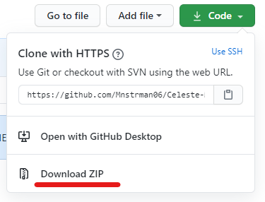
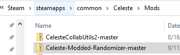
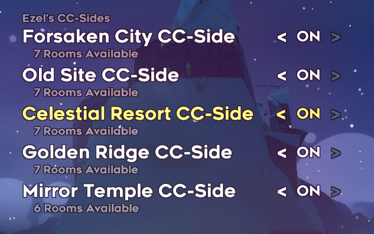

# Celeste-Modded-Randomizer
A Mod for the [Celeste Randomizer](https://github.com/rhelmot/CelesteRandomizer) Mod which adds Custom Map Support to the Randomizer. You can download the Celeste Randomizer mod [here](https://gamebanana.com/tools/6848).
-
This mod currently only supports [Ezel's CC-Sides](https://gamebanana.com/maps/207309) 1CC-5CC.

Overtime this will be expanded to support other mods and the other CC-Sides.

How to install?
-
1. First, make sure you have [Everest](https://everestapi.github.io/) installed, as it is required to run both randomizer and this support pack.
2. Click "Code" and then click "Download Zip"

3. Next, drop this Zip folder in your "Mods" folder for Celeste. (Note that this example is for Windows)

4. Upon reloading the game, you should find 1CC-5CC in "Select Maps To Randomize"

Bug Reports
-
If you find any maps that are impossible to complete or an area where you die instantly upon entering a room, please report it here.

(Preferably with seed and settings)

Known Issues
-
Labyrinth is impossible with the golden berry due to how gems do not bubble you back to the beginning of a room.

Softlock in 4CC.

Many jumpthrough tweaks that can be added to support more holes.

Credits
-
**Map Creators:**

Ezel - **Creator of the CC-Sides**

**Configuration Files:**

Mnstrman06 **(1CC, 2CC, 3CC)**

[nebs13](https://github.com/nebs13/) **(1CC, 2CC, 4CC, 5CC)**

**Playtesters/Difficulty Labbing:**

Luma **(CC-Sides)**

Ezel **(CC-Sides)**
