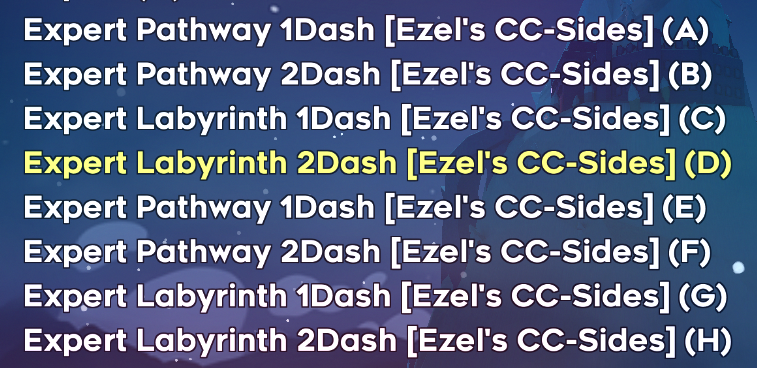
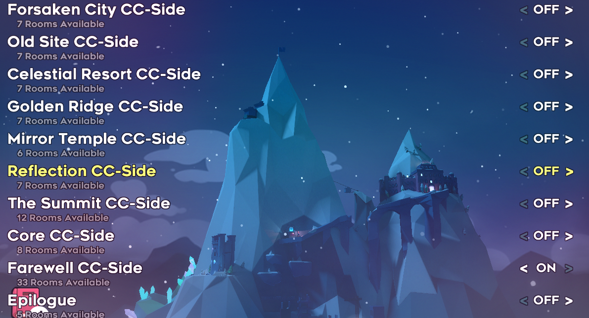
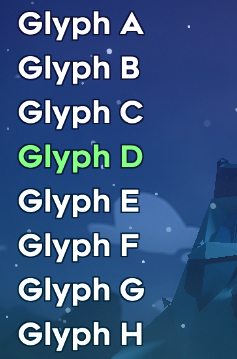
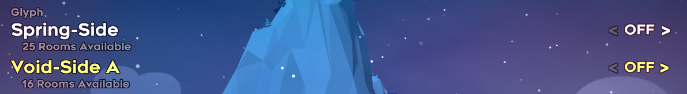

# Celeste Randomizer Helper
A Mod for the [Celeste Randomizer](https://github.com/rhelmot/CelesteRandomizer) Mod which adds Custom Map Support to the Randomizer. You can download the Celeste Randomizer mod [here](https://gamebanana.com/tools/6848).
-
This mod currently supports [Ezel's CC-Sides](https://gamebanana.com/maps/207309) and [Glyph](https://gamebanana.com/maps/209296).
It also puts the music of the following mods into the randomizer:

* Glyph
* Frozen Heights
* Solaris
* eDselec
* Flavors of Pi
* Seaside C-Side
* Dadsides
* Cryoshock
* Anubi
* Knipe
* Fourth Dimension
* The Abyss
* Foe-En Monolith
* Temporal Shrine
* Midnight Aquarium
* Winter Collab
* Into The Jungle

Overtime this will be expanded to support more and more mods.

How to install?
-
1. First, make sure you have [Everest](https://everestapi.github.io/) installed, as it is required to run both randomizer and this support pack.
2. Install the mod [Here](https://gamebanana.com/mods/53709).
3. Upon reloading the game, you should find new maps in "Select Maps To Randomize", as well as rulesets.

Bug Reports
-
If you find any maps that are impossible to complete or an area where you die instantly upon entering a room, please report it here.

(Preferably with seed and settings)

Known Issues
-

Glyph Stylegrounds are not set up properly, they appear but are not aligned correctly.

Credits
-
The credits for this mod can be found on the [gamebanana](https://gamebanana.com/mods/53709) page.
